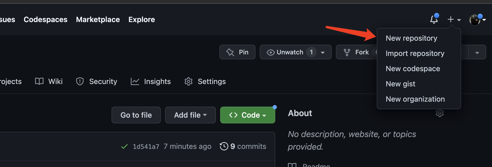
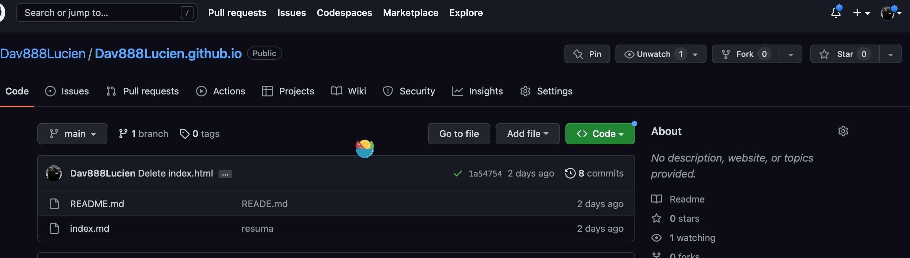
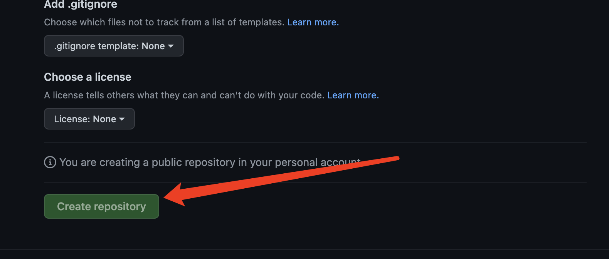
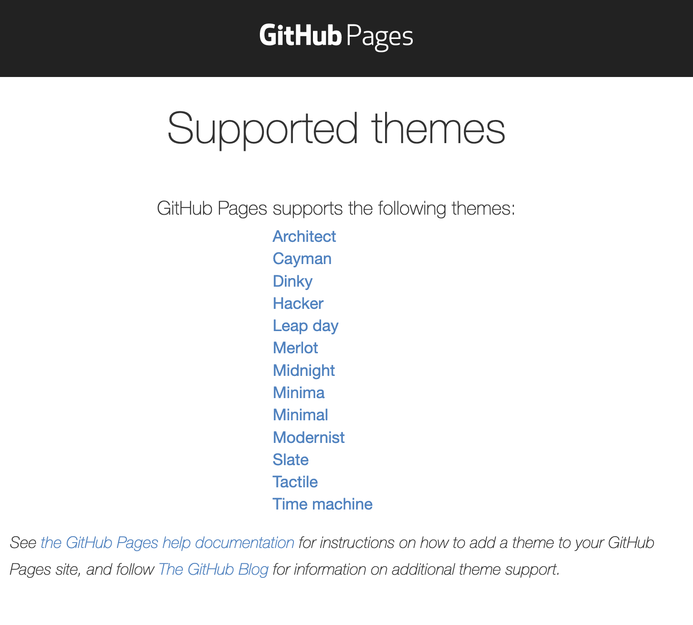
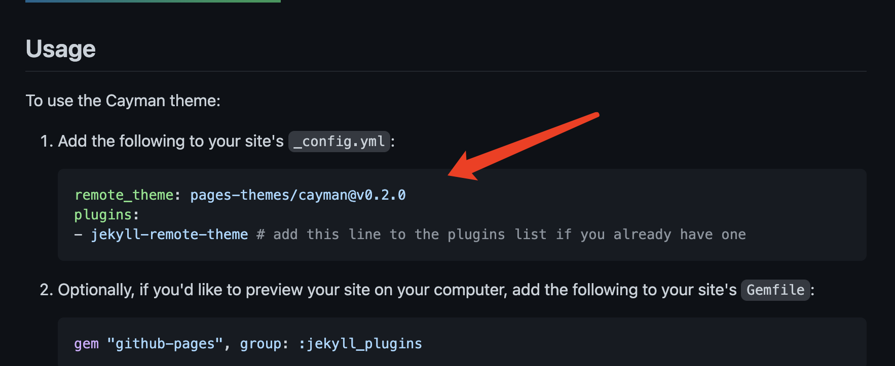
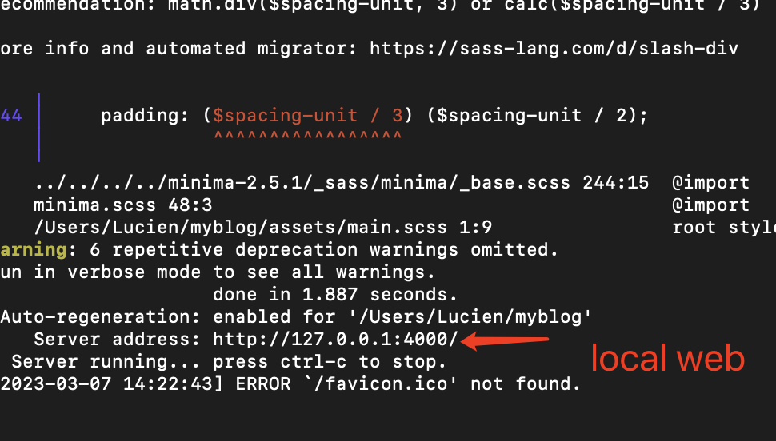
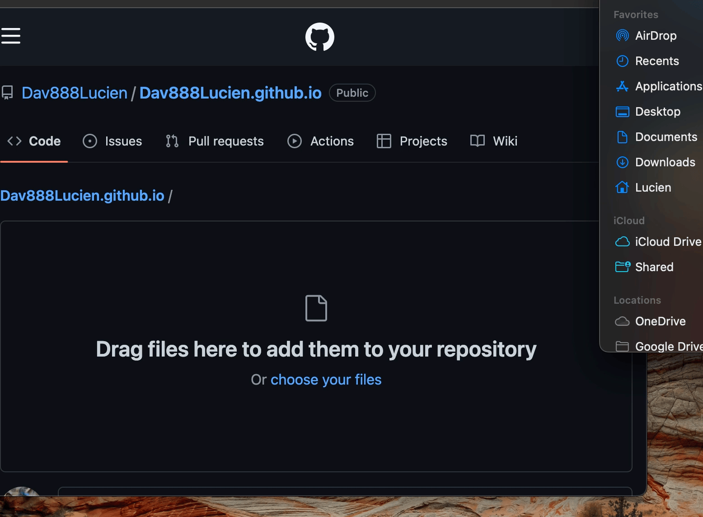

# How to Host a Resume on GitHub Pages

This README tutorial goes over the steps on how to create a resume written in the Markdown markup language, and hosting it on GitHub pages. Throughout this document, the general principles of Andrew Etter's book "Modern Technical Writing" is demonstrated and later explained. 

---
## Prerequisites
Prerequisites:

A resume formatted in Markdown
[A GitHub account](https://pages.github.com/)
[Markdown Tutorial](https://www.markdowntutorial.com/)


---
## Contents
* [Instructions](#Instructions)
   * [Create a Repository](#Create-a-Repository)
   * [Choosing a Jekyll Theme For Your GitHub Page](#Choosing-a-Jekyll-Theme-For-Your-GitHub-Page)
* [Jekyll](#More-Resources)
  * [Download a Jekyll](#Download-a-Jekyll)
  * [Run Jekyll web](#Download-a-Jekyll)
*[Publish Your Resume on GitHub Pages](#Publish Your Resume on GitHub Pages)
* [FAQs](#FAQs)

--- 
# Instructions


#### Creating the Repository

1. Log into your [GitHub](https://GitHub.com) account.
2. At the top right corner of the website, click on the '**+**' symbol and select "**New Repository**".
3. Give your repository a name as"username.github.io". 
4. Choose "**Public**" visibility for your repository, and initialise the repository with a README file.
6. Finally, click on "**Create Repository**" to finish.photo
7. Clone the Repository
    *Open VS Code and click on "Clone Repository" on the welcome screen.
    *Enter the URL of the repository you just created and select a location on your computer to clone the repository to 
    

---
Jekyll
---
1. Homebrew makes it easy to install development tools on a Mac.
```
/bin/bash -c "$(curl -fsSL https://raw.githubusercontent.com/Homebrew/install/HEAD/install.sh)
```
2. Install chruby and the latest Ruby with ruby-install
```
brew install chruby ruby-install xz
```
3. Install the latest stable version of Ruby (supported by Jekyll):
```
ruby-install ruby 3.1.3
```
```
echo "source $(brew --prefix)/opt/chruby/share/chruby/chruby.sh" >> ~/.zshrc
echo "source $(brew --prefix)/opt/chruby/share/chruby/auto.sh" >> ~/.zshrc
echo "chruby ruby-3.1.3" >> ~/.zshrc # run 'chruby' to see actual version
```
4. Install Jekyll
 ```
 gem install jekyll
 ```
5. make new file

6. go to [website](https://pages.github.com/themes/) choose one theme


7. set on configure


8. run static web on local device
```
bundle exec jekyll serve
```

9. Open a web browser and go to http://localhost:4000 to preview your resume.

8. upload config to github


---
Publish Your Resume on GitHub Pages
---
 1. Commit upload file and push them to your repository.
  
 2. Go to your repository's settings and scroll down to the "GitHub Pages" section. 
 3. Your resume is now accessible at https://username.github.io.

## FAQs
**Why is my resume not showing up?**
* Make sure Your resume must named ```index.md```, or it will not be recognised by GitHub Pages. 

**Why is Markdown better than a word processor?**
* Markdown is a plain text formatting syntax that is easy to read and write. It allows you to focus on the content of your document without worrying about formatting. 


